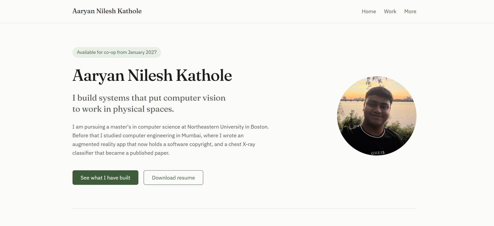
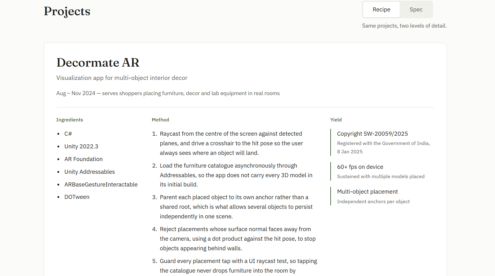

# Aaryan Kathole — personal homepage

A three-page static homepage built with vanilla HTML5, CSS3 and ES6 modules. No
frameworks, no component libraries, no build step.

## Author

**Aaryan Nilesh Kathole**
<kathole.a@northeastern.edu> | [LinkedIn](https://www.linkedin.com/in/aaryan-kathole-9433a0398/) | [GitHub](https://github.com/Aaryan0111)

## Class

CS 5610 Web Development, Northeastern University.
Instructor: John Alexis Guerra Gomez.
Course page: <https://johnguerra.co/classes/webDevelopment_online_fall_2026/>

**Live site:** <https://aaryan0111.github.io/project-1-my-homepage/>

## Screenshot





<!-- TODO: retake both screenshots in your own browser after deploying, so the web fonts render. -->

## Video demo

A short narrated walkthrough: <!-- TODO: paste your YouTube link here -->

## Presentation slides

Project 1 presentation: <!-- TODO: paste your Google Slides link here -->

## Project objective

Build a personal homepage that works as a professional front door: somewhere a
recruiter, a hiring manager or a collaborator can land and understand within a
minute what I do, what I have shipped, and how to reach me.

The site has three pages:

| Page | File | What it is |
| --- | --- | --- |
| Home | `index.html` | Who I am, availability, three headline achievements |
| Work | `work.html` | Projects, skills, education and experience |
| More | `more.html` | Travel, films and food — **AI-generated** |

## Original component

The work page presents each project as a **recipe card**: Ingredients (the
stack), Method (what I actually did, in order) and Yield (the outcome, with the
number or registration ID behind it). A toggle switches every card between this
recipe view and a dense spec view.

Both views render from one data structure in `js/data/projects.js`, so they can
never drift apart. The recipe view is also present as plain HTML in `work.html`,
so the page stays readable with JavaScript disabled; `js/projects-view.js`
replaces it on load and enables the toggle.

## Build and run

Prerequisites: [Node.js](https://nodejs.org) 18 or newer, and Git.

```bash
git clone https://github.com/Aaryan0111/project-1-my-homepage.git
cd project-1-my-homepage
npm install
npm start
```

`npm start` serves the site at http://localhost:8080 and opens it.

There is no build step — the browser loads the ES6 modules directly. A local
server is still required, because ES6 modules do not load over the `file://`
protocol.

### Checks

```bash
npm run lint          # ESLint, should report zero problems
npm run format:check  # Prettier, should report no changes needed
npm run format        # Prettier, rewrites files in place
```

HTML is validated at https://validator.w3.org.

## Tech stack

| Layer | Technologies |
| --- | --- |
| Markup | HTML5 |
| Styling | CSS3 (Grid and Flexbox, hand-written), Google Fonts |
| Scripting | Vanilla JavaScript, ES6 modules |
| Tooling | ESLint, Prettier, http-server, Node.js (dev only) |
| Deployment | GitHub Pages (static hosting) |

No frameworks and no component libraries are used. The layout is hand-written
CSS Grid and Flexbox rather than Bootstrap.

## Project structure

```
.
├── index.html            Home
├── work.html             Work
├── more.html           More (AI-generated)
├── css/
│   └── style.css         Single stylesheet, organised by section
├── js/
│   ├── main.js           Entry point
│   ├── nav.js            Mobile navigation
│   ├── projects-view.js  Recipe/spec rendering and toggle
│   └── data/
│       └── projects.js   Project data
├── images/               Images and favicon
├── files/                Resume PDF
├── docs/
│   ├── DESIGN.md         Design document
│   └── mockups/          Wireframes
├── package.json
├── eslint.config.js
├── .prettierrc
└── LICENSE
```

## Design document

The full design document — project description, user personas, user stories and
mockups — is at [`docs/DESIGN.md`](docs/DESIGN.md).

## Use of generative AI

**Tool:** Claude by Anthropic (claude.ai), model Claude Opus 5

**Prompts used:**

1. "Help me build my personal homepage from scratch. It should be 3 pages where 2 pages have my own input and the 3rd is an AI page. We will have a step by step approach as I am new to this subject."
2. "Write the design document including project description, user personas, user stories and design mockups."
3. "I have travelled to 8 states in the USA, and to Thailand, Malaysia and Singapore. I like Interstellar, 3 Idiots, Batman and Marvel. I like Indian, Thai, Nepali, American, Italian and Burmese food. Write the More page from this."
4. "Create a clear and descriptive README including: Author, Class Link, Project Objective, Screenshot, Instructions to build, Video Demo, GenAI Usage, References, Google Slides."
5. "Given the rubric, please check the code for any omissions or any missing parts."

**How it was used:** I supplied all the content and made the design decisions;
the model drafted markup, styles and copy from what I gave it. The `more.html`
page is the AI-generated page required by the assignment: I listed the places,
films and cuisines and the model wrote them up.

**What I changed:** renamed the third page, removed an AI-disclosure banner from
the page itself, dropped a proposed world map, corrected wording that implied I
had already graduated, fixed a wrong screenshot and third-person alt text, and
trimmed the design document back to what the rubric asks for.

## Sources and references

- MDN Web Docs: <https://developer.mozilla.org>
- MDN, Your first website: <https://developer.mozilla.org/en-US/docs/Learn_web_development/Getting_started/Your_first_website>
- MDN, CSS styling basics: <https://developer.mozilla.org/en-US/docs/Learn_web_development/Core/Styling_basics>
- Fraunces on Google Fonts: <https://fonts.google.com/specimen/Fraunces>
- IBM Plex Sans on Google Fonts: <https://fonts.google.com/specimen/IBM+Plex+Sans>
- W3C Markup Validation Service: <https://validator.w3.org>

## License

MIT — see [LICENSE](LICENSE).
