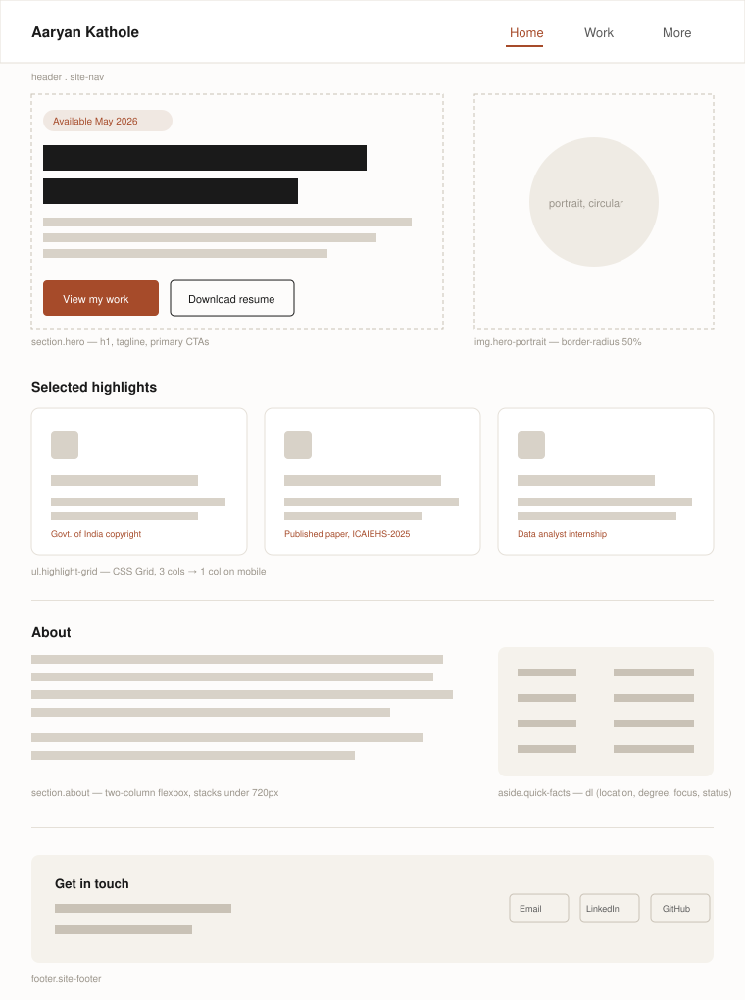
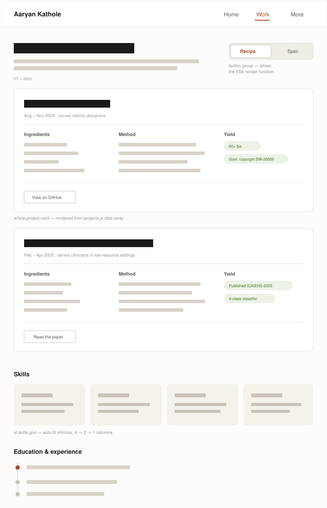
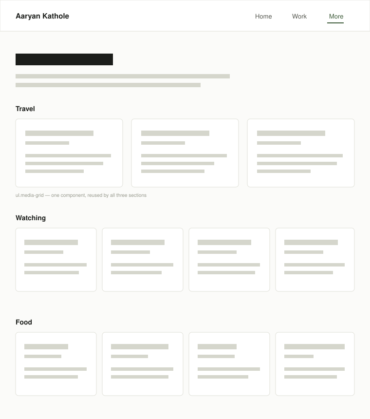

# Design document — Personal homepage

**Author:** Aaryan Nilesh Kathole
**Program:** MS in Computer Science, Khoury College, Northeastern University
**Repository:** https://github.com/Aaryan0111
**Version:** 1.0

---

## 1. Project description

### 1.1 What this is

A three-page static personal homepage built with vanilla HTML5, CSS3 and ES6+ JavaScript. No backend, no frameworks, no component libraries. The site is deployed to GitHub Pages and serves as my public professional presence.

### 1.2 Why it exists

I am available for co-op and internship positions from May 2026 onwards. A resume PDF is a single artifact that gets skimmed inside an applicant tracking system; a homepage is something I can put on a resume, a LinkedIn profile and an email signature, and it lets a reader go deeper on whichever part interests them. The site has one primary job: **convince a recruiter or hiring manager, in under two minutes, that I build real things and that my work has verifiable outcomes.**

The evidence I have to work with is unusually concrete for a student, and the design is built around surfacing it rather than burying it:

- A copyright registration from the Government of India (SW-20059/2025) for Decormate AR
- A peer-reviewed publication at MULTINOVA ICAIEHS-2025 (DOI: 10.2991/978-94-6463-852-3_19)
- A six-month data analyst internship with measurable scope (10,000+ records)

### 1.3 Scope

| In scope | Out of scope |
| --- | --- |
| Three pages, static, client-side only | Any server, database or API |
| Hand-written CSS Grid and Flexbox layout | Bootstrap or any CSS framework |
| ES6 modules, no bundler | React, Vue, jQuery |
| Responsive down to 360px | Native mobile apps |
| WCAG-minded semantics and alt text | Full WCAG 2.1 AA audit |

### 1.4 Technical constraints

These come from the assignment and act as hard design constraints:

1. Vanilla HTML5, CSS3, ES6+ only. No component libraries, no jQuery.
2. All JavaScript in ES6 modules, loaded with `<script type="module">`; `"type": "module"` set in `package.json`.
3. CSS, JS, images and other assets each live in their own folder.
4. Must validate cleanly at https://validator.w3.org with zero errors.
5. Must pass the class ESLint config with zero errors, and be formatted with Prettier.
6. No `!important` anywhere in the stylesheet.
7. Elements are identified by `class`, not by tag-position or inline styling hooks.
8. Standard elements for standard jobs — a button is a `<button>`, never a styled `<div>` or `<span>`.
9. Every image carries a meaningful `alt` value.
10. MIT licensed.

### 1.5 Information architecture

```
/                 index.html    Home      Who I am, availability, headline achievements
/work.html        work.html     Work      Projects, skills, education, experience
/more.html      more.html   More      Travel, films and food (AI-generated)
```

Three pages, three distinct URLs, one shared header and footer. `more.html` is the AI-generated page required by the rubric; the GenAI documentation section in the README covers this page only.

---

## 2. User personas

Three personas, drawn from who actually reaches a student homepage. Each one changes a real design decision, noted at the end of each profile.

### Persona 1 — Priya Raghavan, technical recruiter

| | |
| --- | --- |
| **Age** | 34 |
| **Role** | Technical recruiter, co-op program at a 400-person software company in Boston |
| **Context** | Screening ~60 candidates for a summer cohort. Usually on a laptop, sometimes on her phone between meetings. |

**Goals**

- Confirm in under a minute that this candidate matches the requisition (degree, graduation date, work authorization window, core languages)
- Find a resume she can attach to an internal submission
- Find a way to contact the candidate

**Frustrations**

- Homepages that open with a paragraph of personal philosophy and never state what the person does
- Availability dates buried three scrolls down, or missing entirely
- Dead "Resume" links, or resumes that only exist as an image
- Sites that don't work on her phone

**Behaviour:** scans, does not read. Scrolls fast. Leaves if she can't orient within about 15 seconds.

> **Design consequence:** availability appears as a pill in the hero, above the fold. Resume download is one of two primary buttons in the hero. Contact details repeat in the footer of every page.

---

### Persona 2 — Daniel Okoro, engineering hiring manager

| | |
| --- | --- |
| **Age** | 41 |
| **Role** | Senior ML engineer; interviews and makes the final call on interns |
| **Context** | Priya forwards him five shortlisted profiles. He opens each one for maybe three minutes before deciding who gets a screen. |

**Goals**

- Judge whether the projects are real engineering or tutorial-following
- See what the candidate personally did versus what a team did
- Find outcomes: numbers, artifacts, shipped things, published things

**Frustrations**

- Skill lists rendered as progress bars ("Python 85%") that mean nothing
- Projects described only by their tech stack, with no problem statement and no result
- No link to source code
- Claims with no evidence behind them

**Behaviour:** reads properly, but only the project section. Clicks through to GitHub and to papers. Deeply suspicious of unsupported claims.

> **Design consequence:** this persona is the reason for the recipe-card format. Every project card forces three things onto the page — Ingredients (stack), Method (what I actually did, step by step), and **Yield** (the outcome, with the number or the registration ID). A project cannot be added to the site without an outcome, because the card layout has a slot for one.

---

### Persona 3 — Sofia Almeida, peer reviewer

| | |
| --- | --- |
| **Age** | 24 |
| **Role** | Fellow MSCS student, assigned to code-review this project |
| **Context** | Reviewing on a laptop with DevTools open. Will read the source, not just the rendered page. |

**Goals**

- Check the page against the rubric: folder structure, ES6 modules, semantic HTML, alt text, no `!important`
- Understand the original JS component well enough to comment on it
- Clone and run it locally

**Frustrations**

- Repos with everything dumped in the root directory
- One 900-line stylesheet with no structure
- READMEs with no build instructions
- Clever code with no comments where the cleverness lives

> **Design consequence:** the README documents setup and build steps explicitly. Source is organised into `css/`, `js/`, `images/`, `docs/`. The project data lives in a separate `js/data/projects.js` module so the render logic reads cleanly and reviewers can see the data/presentation split.

---

## 3. User stories

Written as: *As a [persona], I want [capability], so that [benefit].* Acceptance criteria state the condition under which the story is complete.

### Epic A — Orient quickly (home page)

**A1.** As Priya, I want to see the candidate's name, degree programme and availability date without scrolling, so that I can decide in seconds whether to keep reading.
- The `<h1>` names me and my programme.
- An availability indicator reading "Available May 2026" renders above the fold at 1280×720 and at 375×667.
- The tagline is one sentence and states what I build.

**A2.** As Priya, I want a clearly labelled resume download in the first screenful, so that I can attach it to an internal submission without hunting.
- A "Download resume" control sits in the hero alongside the primary call to action.
- It links to a PDF committed to the repository, so it cannot 404.

**A3.** As Daniel, I want three headline achievements summarised on the landing page, so that I can tell within one screen whether this candidate is worth three minutes.
- A highlights grid shows exactly three items: the copyright registration, the publication, and the internship.
- Each is a link through to fuller detail on the work page or to an external source.

**A4.** As any visitor, I want the site to be readable on my phone, so that I can look at it away from my desk.
- The layout reflows to a single column below 720px.
- No horizontal scrolling at 360px width.
- Tap targets are at least 44×44px.

### Epic B — Evaluate the work (work page)

**B1.** As Daniel, I want each project to state its outcome explicitly, so that I can distinguish shipped work from coursework.
- Every project card renders a Yield section.
- Each Yield contains at least one verifiable item: a metric, a registration number, or a DOI.

**B2.** As Daniel, I want to see what technologies each project used and what I personally did, separated from each other, so that I can assess depth rather than read a blended paragraph.
- Ingredients lists the stack as discrete items.
- Method lists implementation steps in order, as an ordered list.

**B3.** As Daniel, I want to switch from the narrative view to a dense technical view, so that I can compare projects quickly once I have the gist.
- A visible toggle switches all cards between Recipe and Spec presentation.
- The toggle operates without a page reload.
- State is applied to every card simultaneously, not per-card.
- The page remains usable with JavaScript disabled: Recipe view is the server-rendered default in the HTML.

**B4.** As Sofia, I want the project content to come from a data structure rather than being hard-coded in markup, so that I can see a clean separation of data and presentation.
- Project content lives in an exported array in `js/data/projects.js`.
- The render module imports it and builds the DOM.

**B5.** As Priya, I want skills grouped by category, so that I can keyword-match against a requisition quickly.
- Skills are grouped as Languages, Databases, Web, Tools.
- No numeric proficiency ratings are shown.

### Epic C — Read the person (more page)

**C1.** As Daniel, I want some sense of who this person is outside their transcript, so that I can judge culture fit before spending a screening slot.
- The page covers travel, films and food.
- Each entry carries a short personal note, not just a title.

**C2.** As Sofia, I want AI-generated content clearly marked as such, so that I can tell authored content from generated content.
- The README names the model, the version, the prompts used, and what I edited afterwards.
- The disclosure lives in the README rather than on the page itself, so the page reads as a personal page rather than a disclaimer.

### Epic D — Review and reuse (cross-cutting)

**D1.** As Sofia, I want to clone the repository and run it locally in under two minutes, so that I can review it properly.
- The README lists prerequisites, install steps, and a single command to serve the site.

**D2.** As any visitor using a screen reader, I want images and controls to be announced meaningfully, so that I can use the site.
- Every `` has a descriptive `alt`; purely decorative images use `alt=""`.
- The toggle is a real `<button>` with `aria-pressed` reflecting its state.
- Landmarks are used: `<header>`, `<nav>`, `<main>`, `<footer>`.

---

## 4. Design mockups

### 4.1 Home — `index.html`



Five bands, top to bottom:

1. **Header** — name on the left, three nav links on the right, current page underlined in the accent colour.
2. **Hero** — availability pill, `<h1>`, one-sentence tagline, supporting paragraph, two calls to action, with a circular portrait to the right. Collapses to a single column under 720px with the portrait above the text.
3. **Selected highlights** — a three-column CSS Grid of achievement cards. This is Daniel's 15-second scan.
4. **About** — two columns: prose on the left, a definition list of quick facts on the right.
5. **Footer** — contact block with email, LinkedIn and GitHub.

### 4.2 Work — `work.html`



The recipe-card view is the creative component.

- **Toggle** sits top-right of the projects section, opposite the heading. Two buttons in a group; the active one is filled.
- **Recipe view** shows Ingredients / Method / Yield in a three-column grid inside each card, with a metadata line reading like a recipe header ("Aug – Nov 2024 · serves interior designers").
- **Spec view** re-renders the same data as a dense definition list: role, duration, stack, architecture summary, results. Same data, different projection.
- **Skills** uses `repeat(auto-fit, minmax(…))` so the column count falls from four to two to one without media queries.
- **Education and experience** is a simple vertical timeline.

### 4.3 More — `more.html`



- Three sections — Travel, Watching, Food — all reusing one card-grid component so the CSS stays small.
- The AI disclosure is documented in the README rather than shown on the page.

### 4.4 Visual design system

**Colour**

| Token | Value | Use |
| --- | --- | --- |
| `--paper` | `#FBFBF9` | Page background |
| `--surface` | `#FFFFFF` | Cards |
| `--panel` | `#EFF0EA` | Quiet panels, footer, skill groups |
| `--ink` | `#1B1D1A` | Body text |
| `--ink-soft` | `#55574F` | Secondary text |
| `--accent` | `#3E5C3A` | Links, active nav, primary button, column headings |
| `--accent-soft` | `#E9EFE6` | Availability pill |
| `--rule` | `#DFE0D8` | Hairlines |

A single deep green accent against cool near-neutrals. One accent colour only — restraint reads as deliberate, and it keeps the stylesheet small enough to stay organised. The greens carry a faint warmth so the page does not read as clinical, but the background is deliberately not cream: warm cream with a terracotta accent has become the default palette of generated pages, and this site should not look like one.

**Type**

- Headings: Fraunces, a variable serif with an optical size axis, so large headings tighten and small ones stay readable.
- Body and interface: IBM Plex Sans.
- Scale follows a 1.25 ratio: 16 / 20 / 25 / 31 / 39 / 49px. Body 16px at line-height 1.65, measure capped at 62 characters.

**Layout**

- Content column capped at 1100px, centred, 32px side padding.
- Vertical rhythm in multiples of 8px.
- CSS Grid for page-level and card-grid layout; Flexbox for one-dimensional rows such as the header and button groups.

**Breakpoints**

| Width | Behaviour |
| --- | --- |
| ≥ 1024px | Full multi-column layout |
| 720–1023px | Highlights and skills drop to two columns |
| < 720px | Everything single column; nav collapses |

---

## 5. Component inventory

| Component | Used on | Notes |
| --- | --- | --- |
| Site header / nav | all | Shared markup; active state set per page by class |
| Hero | home | Two columns with a circular portrait; stacks on mobile |
| Highlight card | home | |
| Quick-facts list | home | Semantic `<dl>` |
| View toggle | work | `<button>` with `aria-pressed`; drives the render module |
| Project card | work | Rendered from data; two presentations |
| Skills grid | work | |
| Timeline | work | |
| Media card grid | more | One component, three sections: travel, watching, food |
| Site footer | all | |

## 6. JavaScript modules

| Module | Responsibility |
| --- | --- |
| `js/main.js` | Entry point; imports and initialises the rest |
| `js/data/projects.js` | Exports the project data array |
| `js/projects-view.js` | Renders project cards; implements the Recipe/Spec toggle |
| `js/nav.js` | Marks the active nav item; handles the mobile nav |

The toggle in `projects-view.js` is the original JavaScript functionality required by the rubric. It is well over five lines and implements real behaviour: it maps over the project data, selects a field projection based on current mode, rebuilds each card's inner DOM, and updates `aria-pressed` on both toggle buttons.

## 7. Out of scope for v1

Deliberately deferred so v1 ships clean:

- Dark mode
- A contact form (would need a backend)
- Filtering or search on the work page
- Animation beyond CSS transitions on hover and focus
